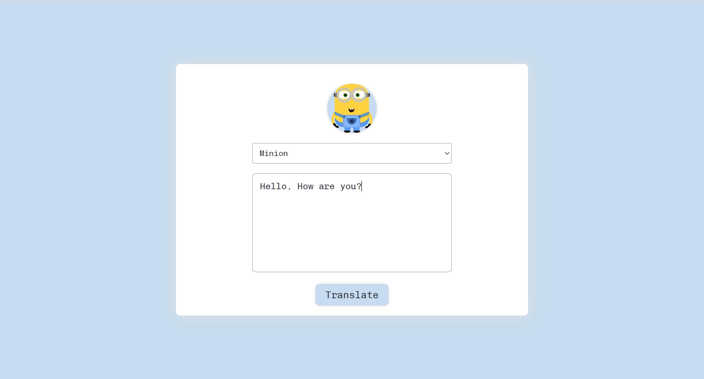
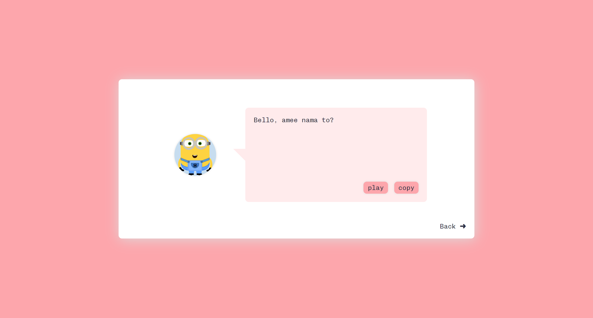
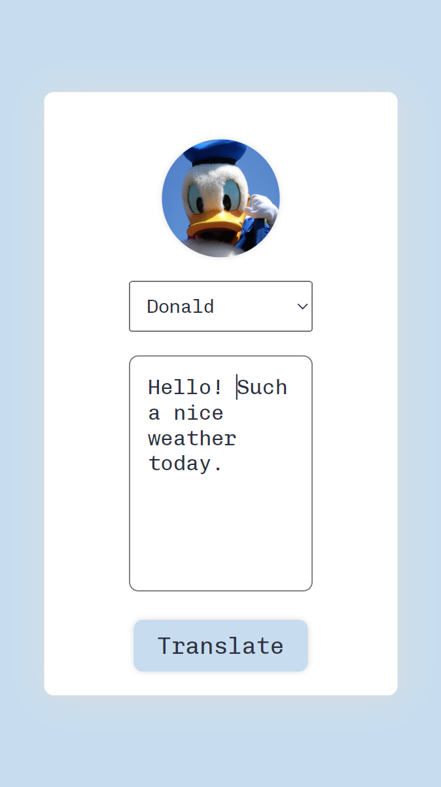
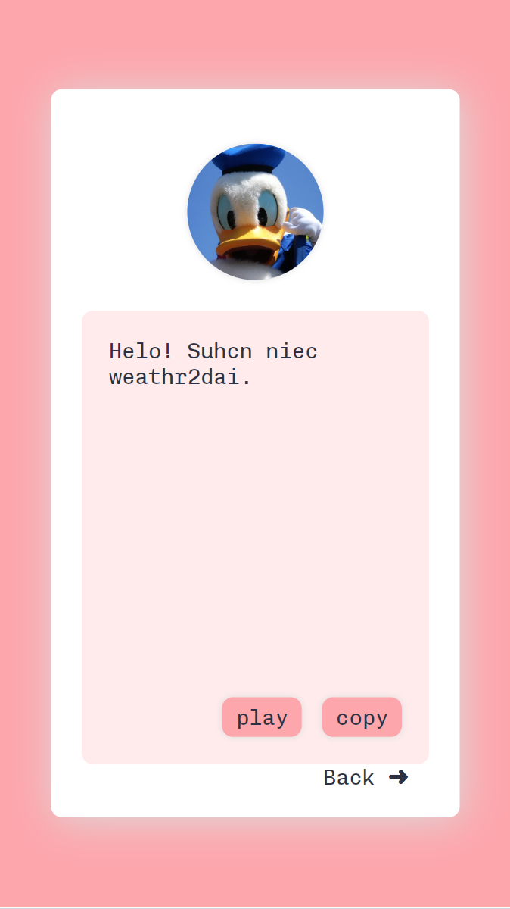

# Fun translation

越來越多電影或動畫，為角色創造自己的語言，若為該部電影迷肯定也會想學習他們的語言，  
非常喜愛小小兵的我也覺得小小兵的語言很可愛，但外面補習班應該是找不到教小小兵語吧 🤣  
這時候就在網路上找到可以將英文翻譯成小小兵的工具，還發現也有其他電影角色語言的翻譯，  
若只將英文翻譯成句子對於學習也還不夠，還需要透過聽力來學習，因此又另外找了可以講文字  
轉變成音檔的工具，促成了這個專案 😊

## Table of contents

- [Overview](#overview)
  - [Screenshot](#screenshot)
  - [Links](#links)
- [My process](#my-process)
  - [Function](#function)
  - [Built with](#built-with)
  - [Sources](#sources)
- [Author](#author)

## Overview

### Screenshot

Desktop 💻  

Mobile 📱  

### Links

- Live Site URL: [Click me !](https://beckyyyyy.github.io/react-funny-translation/)

## My process

### Function

1. 選擇欲翻譯語言，並輸入欲翻譯的英文句子。
2. 點擊 "Translate" 將句子翻譯成所選的語言。
3. 點擊 "Play" 可以將句子播放出來。
4. 點擊 "Copy" 可以將句子複製至剪貼簿。

### Built with

- Built with React
- CSS Modules
- axios API
- Responsive web design

### Sources

使用 API：  
翻譯 API：https://funtranslations.com/api/  
voice API：https://www.voicerss.org/api/

圖片選用符合創用 cc 授權：  
Avatar: https://www.flickr.com/photos/bagogames/  
Minion: https://pixabay.com/illustrations/minion-cartoon-character-2098869/  
Vulcan: https://www.flickr.com/photos/cdrummbks/3807425971  
Sith: https://commons.wikimedia.org/wiki/File:Flag_of_the_Sith_Empire.png#/media/File:Flag_of_the_Sith_Empire.png
valyrian: https://commons.wikimedia.org/wiki/File:Targaryen_Shield.png#/media/File:Targaryen_Shield.png  
Ferb Latin: https://pxhere.com/en/photo/327325?utm_content=shareClip&utm_medium=referral&utm_source=pxhere  
Donald: https://pixabay.com/photos/animal-duck-donald-duck-disney-1772737/

## Author

- [Website](https://beckyyyyy.github.io/portfolio/)
- [Gmail](nkes50723@gmail.com)
